# JetLinks 核心概念与数据结构

本文档基于 `jetlinks-community` 源码梳理 JetLinks 平台七大核心维度的概念、对应数据结构及其关系。

> **说明**：标注为「外部依赖」的类定义于 Maven 依赖包中（如 `jetlinks-core`、`rule-engine-api`、`reactor-ql`、`hswebframework`），不在本仓库源码内，但为本平台运行时核心模型。

---

## 1. 设备与物模型管理 (Device & Things)

物联网平台的基础，负责对物理设备进行数字孪生建模和生命周期管理。

### 1.1 DeviceProduct（设备产品）

设备的集合模板，定义一类设备的通用特征。

| 层级 | 类/接口 | 路径 |
|------|---------|------|
| 持久化实体 | `DeviceProductEntity` | `jetlinks-manager/device-manager/.../entity/DeviceProductEntity.java` |
| 数据库表 | `dev_product` | — |
| 运行时 DTO | `ProductInfo` | 外部依赖 `org.jetlinks.core.device.ProductInfo` |
| 运行时操作接口 | `DeviceProductOperator` | 外部依赖 `org.jetlinks.core.device.DeviceProductOperator` |
| API 详情 DTO | `ProductDetail` | `jetlinks-manager/device-manager/.../entity/ProductDetail.java` |

**关键字段（`DeviceProductEntity`）**：

| 字段 | 说明 |
|------|------|
| `id` | 产品 ID |
| `name` | 产品名称 |
| `classifiedId` / `classifiedName` | 所属品类 |
| `messageProtocol` / `transportProtocol` | 消息协议 / 传输协议 |
| `metadata` | 物模型 JSON（核心） |
| `deviceType` | 设备类型（`DeviceType`：device / gateway / childrenDevice） |
| `configuration` | 协议配置（Map） |
| `accessId` / `accessProvider` / `accessName` | 设备接入方式 |
| `storePolicy` / `storePolicyConfiguration` | 数据存储策略 |
| `state` | 产品状态（1 正常 / 0 禁用） |

### 1.2 DeviceInstance（设备实例）

具体的物理设备节点，归属于某个特定的产品。

| 层级 | 类/接口 | 路径 |
|------|---------|------|
| 持久化实体 | `DeviceInstanceEntity` | `jetlinks-manager/device-manager/.../entity/DeviceInstanceEntity.java` |
| 数据库表 | `dev_device_instance` | — |
| 运行时 DTO | `DeviceInfo` | 外部依赖 `org.jetlinks.core.device.DeviceInfo` |
| 运行时操作接口 | `DeviceOperator` | 外部依赖 `org.jetlinks.core.device.DeviceOperator` |
| API 详情 DTO | `DeviceDetail` | `jetlinks-manager/device-manager/.../entity/DeviceDetail.java` |

**关键字段（`DeviceInstanceEntity`）**：

| 字段 | 说明 |
|------|------|
| `id` | 设备 ID |
| `name` | 设备名称 |
| `productId` / `productName` | 所属产品 |
| `deviceType` | 设备类型 |
| `state` | 设备状态（`DeviceState`：notActive / offline / online） |
| `configuration` | 设备配置（Map） |
| `deriveMetadata` | 派生/独立物模型 JSON |
| `parentId` | 父设备 ID（网关子设备） |
| `features` | 设备特性（`DeviceFeature[]`） |

**相关子实体**：

| 类 | 表 | 关系 |
|----|-----|------|
| `DeviceTagEntity` | `dev_device_tags` | `deviceId` → 设备 |
| `DeviceMetadataMappingEntity` | `dev_metadata_mapping` | 物模型 ID 映射 |

### 1.3 ThingMetadata（物模型 / 设备元数据）

描述设备能力的数字模型，包含 Property（属性）、Event（事件）、Function（服务/功能）三类核心元素。

| 接口/类 | 包路径 | 说明 |
|---------|--------|------|
| `Metadata` | `org.jetlinks.core.metadata.Metadata` | 基础：`id`, `name`, `description`, `expands` |
| `ThingMetadata` | `org.jetlinks.core.things.ThingMetadata` | 通用物模型接口（外部依赖） |
| `DeviceMetadata` | `org.jetlinks.core.metadata.DeviceMetadata` | 设备物模型，extends `ThingMetadata` |
| `SimpleDeviceMetadata` | `org.jetlinks.core.metadata.SimpleDeviceMetadata` | 默认实现 |
| `CompositeDeviceMetadata` | `org.jetlinks.core.metadata.CompositeDeviceMetadata` | 合并两个物模型 |
| `ThingMetadataType` | `org.jetlinks.core.things.ThingMetadataType` | 枚举：`property`, `function`, `event`, `tag` |

**ThingMetadata 结构**：

```java
List<PropertyMetadata> getProperties();   // 属性：连续性运行状态（温度、湿度等）
List<FunctionMetadata> getFunctions();    // 服务/功能：平台可下发的执行指令
List<EventMetadata> getEvents();          // 事件：设备主动上报（告警、故障等）
List<PropertyMetadata> getTags();         // 标签
List<ThingMetadata> getModules();         // 模块（since 1.2.2）
```

**子元素接口**：

| 类型 | 接口 | 关键属性 |
|------|------|----------|
| Property（属性） | `PropertyMetadata` | `id`, `name`, `valueType`（`DataType`）, `expands` |
| Function（功能） | `FunctionMetadata` | `id`, `name`, `inputs`, `output`, `async`, `expands` |
| Event（事件） | `EventMetadata` | `id`, `name`, `type`/`valueType`, `expands` |

**物模型 JSON 存储位置**：

| 实体 | 字段 | 说明 |
|------|------|------|
| `DeviceProductEntity` | `metadata` | 产品级物模型 |
| `DeviceInstanceEntity` | `deriveMetadata` | 设备级独立/派生物模型 |
| `DeviceCategoryEntity` | `metadata` | 品类级物模型模板 |

编解码：`JetLinksDeviceMetadataCodec`（外部依赖 `jetlinks-supports`）负责 JSON ↔ `DeviceMetadata` 转换。有效物模型 = 产品物模型 + 设备 `deriveMetadata`（`CompositeDeviceMetadata` 合并）。

### 1.4 DeviceCategory（设备分类）

对设备进行的业务分类管理，树形结构。

| 层级 | 类/接口 | 路径 |
|------|---------|------|
| 持久化实体 | `DeviceCategoryEntity` | `jetlinks-manager/device-manager/.../entity/DeviceCategoryEntity.java` |
| 数据库表 | `dev_product_category` | — |
| 默认数据 | `device-category.json` | `jetlinks-manager/device-manager/src/main/resources/` |

**关键字段（`DeviceCategoryEntity`）**：

| 字段 | 说明 |
|------|------|
| `id` | 品类 ID（树形，如 `1-2-3-`） |
| `key` | 品类标识（如 `SmartCity`） |
| `name` | 品类名称 |
| `metadata` | 品类物模型模板（JSON） |
| `parentId` / `sortIndex` / `path` | 树形结构字段（继承 `GenericTreeSortSupportEntity`） |
| `children` | 子节点（内存树，非 DB 列） |

### 1.5 设备与物模型关系图

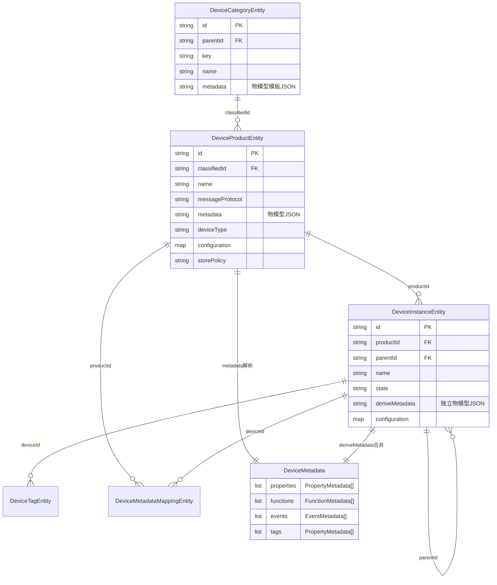

---

## 2. 网络接入与网关 (Network & Gateway)

屏蔽底层网络通信细节，负责设备与平台之间的连接建立和数据收发。

### 2.1 Network（网络组件）

提供底层通信能力，支持 TCP、HTTP、MQTT 等多种协议，基于 Vert.x 实现高性能网络服务。

| 层级 | 类/接口 | 路径 |
|------|---------|------|
| 根接口 | `Network` | `jetlinks-components/network-component/network-core/.../Network.java` |
| 服务端扩展 | `ServerNetwork` | 同上目录 |
| 配置接口 | `NetworkConfig` | 同上目录 |
| 类型枚举 | `DefaultNetworkType` | `TCP_CLIENT`, `TCP_SERVER`, `MQTT_*`, `HTTP_*`, `WEB_SOCKET_*`, `UDP`, `COAP_*` |
| 创建/管理 | `NetworkProvider<P>` / `NetworkManager` | 同上目录 |
| 持久化实体 | `NetworkConfigEntity` | `jetlinks-manager/network-manager/.../entity/NetworkConfigEntity.java` |
| 数据库表 | `network_config` | — |

**关键字段（`NetworkConfigEntity`）**：

| 字段 | 说明 |
|------|------|
| `name` / `description` | 名称 / 描述 |
| `type` | 网络类型 |
| `state` | 状态 |
| `configuration` | 配置（Map） |
| `shareCluster` / `cluster` | 集群共享 / 按节点分配置 |

**各协议实现**：

| 类型 | 接口 | 实现类 | 配置类 |
|------|------|--------|--------|
| TCP Server | `TcpServer` | `VertxTcpServer` | `TcpServerProperties` |
| TCP Client | `TcpClient` | `VertxTcpClient` | `TcpClientProperties` |
| MQTT Server | `MqttServer` | `VertxMqttServer` | `VertxMqttServerProperties` |
| HTTP Server | `HttpServer` | `VertxHttpServer` | `HttpServerConfig` |

### 2.2 DeviceGateway（设备网关）

建立在 Network 之上，处理特定设备接入逻辑的网关实体。

| 层级 | 类/接口 | 路径 |
|------|---------|------|
| 根接口 | `DeviceGateway` | `jetlinks-components/gateway-component/.../DeviceGateway.java` |
| 抽象基类 | `AbstractDeviceGateway` | 同上目录 |
| 状态枚举 | `GatewayState` | starting / started / paused / shutdown |
| 提供商接口 | `DeviceGatewayProvider` | `.../supports/DeviceGatewayProvider.java` |
| 运行时配置 | `DeviceGatewayProperties` | 同上目录 |
| 持久化实体 | `DeviceGatewayEntity` | `jetlinks-manager/network-manager/.../entity/DeviceGatewayEntity.java` |
| 数据库表 | `device_gateway` | — |

**关键字段（`DeviceGatewayEntity`）**：

| 字段 | 说明 |
|------|------|
| `name` / `description` | 名称 / 描述 |
| `provider` | 网关提供商（如 `tcp-server-gateway`） |
| `channelId` | 绑定的网络组件 ID |
| `protocol` / `transport` | 协议 / 传输层 |
| `configuration` | 网关配置（Map） |
| `state` | 网关状态 |

**各协议 Gateway 实现**：

| Provider ID | 实现类 | 绑定 Network |
|-------------|--------|--------------|
| `tcp-server-gateway` | `TcpServerDeviceGateway` | `TcpServer` |
| `mqtt-server-gateway` | `MqttServerDeviceGateway` | `MqttServer` |
| `mqtt-client-gateway` | `MqttClientDeviceGateway` | `MqttClient` |
| `http-server-gateway` | `HttpServerDeviceGateway` | `HttpServer` |

### 2.3 DeviceSession（设备会话）

维持和管理设备与平台连接的生命周期。

| 层级 | 类/接口 | 路径 |
|------|---------|------|
| 核心接口 | `DeviceSession` | 外部依赖 `org.jetlinks.core.server.session.DeviceSession` |
| 扩展接口 | `ReplaceableDeviceSession`, `PersistentSession` | 外部依赖 jetlinks-core |
| 会话管理 | `DeviceSessionManager` | 外部依赖 jetlinks-core |
| Community 实现 | `PersistenceDeviceSessionManager` | `jetlinks-components/configure-component/.../PersistenceDeviceSessionManager.java` |

**核心方法（从实现类推断）**：

| 方法 | 说明 |
|------|------|
| `getId()` / `getDeviceId()` | 会话/设备 ID |
| `getOperator()` | `DeviceOperator` |
| `getTransport()` | 传输协议 |
| `send(EncodedMessage)` | 下行消息 |
| `close()` / `ping()` / `isAlive()` | 生命周期 |
| `lastPingTime()` / `connectTime()` | 时间戳 |

**本仓库实现类**：

| 实现类 | 协议 | 包装对象 |
|--------|------|----------|
| `TcpDeviceSession` | TCP | `TcpClient`, `DeviceOperator` |
| `MqttConnectionSession` | MQTT Server | `MqttConnection` |
| `MqttClientSession` | MQTT Client | `MqttClient` |
| `HttpDeviceSession` | HTTP | `DeviceOperator`, `WebSocketExchange` |

### 2.4 PayloadParser（报文解析器）

针对 TCP 协议，处理粘包、拆包的解析策略（HTTP/MQTT 不使用）。

| 层级 | 类/接口 | 路径 |
|------|---------|------|
| 根接口 | `PayloadParser` | `jetlinks-components/network-component/tcp-component/.../parser/PayloadParser.java` |
| 类型枚举 | `PayloadParserType` | 同上目录 |
| 构建器 | `PayloadParserBuilder` / `DefaultPayloadParserBuilder` | 同上目录 |

**PayloadParserType 枚举**：

| 值 | 说明 | 实现 |
|----|------|------|
| `DIRECT` | 不处理，直接透传 | `DirectRecordParser` |
| `FIXED_LENGTH` | 固定长度 | Vertx `RecordParser` |
| `DELIMITED` | 分隔符 | `DelimitedPayloadParserBuilder` |
| `SCRIPT` | 脚本自定义 | `ScriptPayloadParserBuilder` → `PipePayloadParser` |
| `LENGTH_FIELD` | 长度字段 | `LengthFieldPayloadParserBuilder` → `PipePayloadParser` |

**ScriptPayloadParser 配置**：`script`（必填）, `lang`（默认 `js`），脚本中注入 `parser`（`PipePayloadParser`）变量，通过链式调用定义解析规则。

### 2.5 网络接入关系图

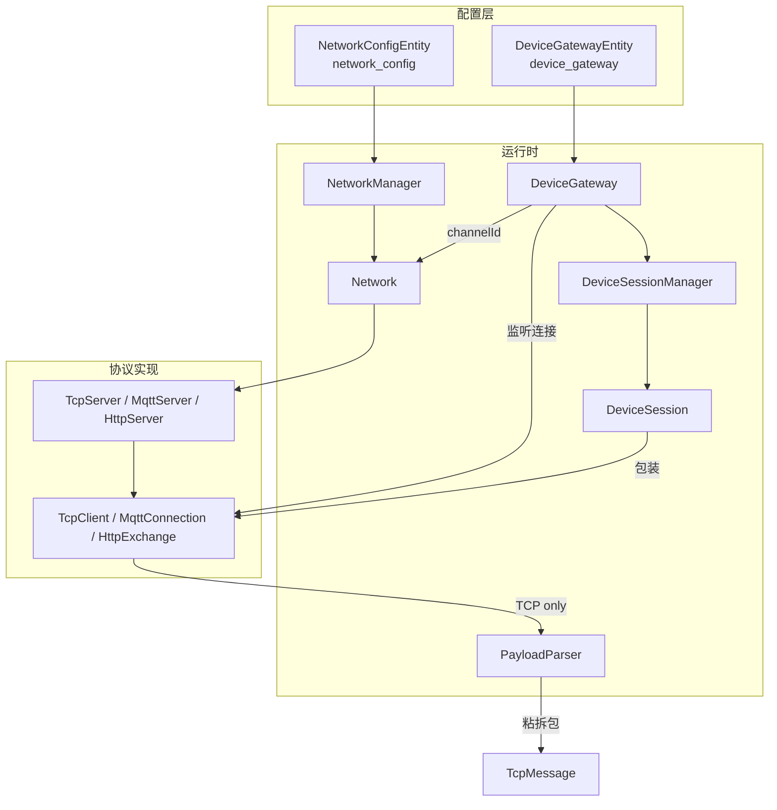

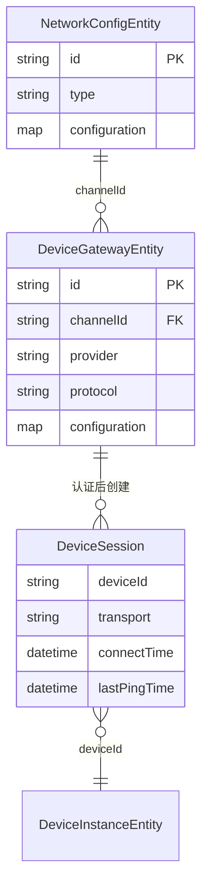

---

## 3. 协议与消息编解码 (Protocol & Message Codec)

处理不同厂商、不同型号设备的异构数据格式。

### 3.1 ProtocolSupport（协议支持）

将设备原始报文转换为平台标准消息，支持脚本或 Jar 包动态加载。

| 层级 | 类/接口 | 路径 |
|------|---------|------|
| 运行时接口 | `ProtocolSupport` | 外部依赖 `org.jetlinks.core.ProtocolSupport` |
| 持久化实体 | `ProtocolSupportEntity` | `jetlinks-components/protocol-component/.../ProtocolSupportEntity.java` |
| 部署定义 | `ProtocolSupportDefinition` | 外部依赖 `jetlinks-supports` |
| 加载器 | `AutoDownloadJarProtocolSupportLoader` | 外部依赖 jetlinks-supports |
| 数据库表 | `dev_protocol` | — |

**关键字段（`ProtocolSupportEntity`）**：

| 字段 | 说明 |
|------|------|
| `id` / `name` / `description` | 基本信息 |
| `type` | 提供商（provider） |
| `state` | 状态 |
| `configuration` | 配置（Map） |

### 3.2 TransparentMessageCodec（透传消息编解码）

用于将设备上报的自定义/二进制格式解析为平台标准 JSON，或将平台下发指令转为设备格式。

| 层级 | 类/接口 | 路径 |
|------|---------|------|
| 接口 | `TransparentMessageCodec` | `jetlinks-manager/device-manager/.../message/transparent/TransparentMessageCodec.java` |
| 持久化实体 | `TransparentMessageCodecEntity` | `.../entity/TransparentMessageCodecEntity.java` |
| Provider | `TransparentMessageCodecProvider` | 同上目录 |
| 数据库表 | `dev_transparent_codec` | — |

**关键字段（`TransparentMessageCodecEntity`）**：

| 字段 | 说明 |
|------|------|
| `productId` / `deviceId` | 绑定产品/设备 |
| `provider` | 编解码器提供商 |
| `configuration` | 配置（Map） |

**核心方法**：

```java
Flux<DeviceMessage> decode(DirectDeviceMessage);
Mono<DirectDeviceMessage> encode(DeviceMessage);
```

### 3.3 DeviceMessage（设备标准消息）

平台内部流通的标准消息模型，所有底层数据最终都会被转换为此格式。

| 层级 | 类/接口 | 路径 |
|------|---------|------|
| 核心接口 | `DeviceMessage` | 外部依赖 `org.jetlinks.core.message.DeviceMessage` |
| 常用基类 | `CommonDeviceMessage`, `DirectDeviceMessage` | 外部依赖 |
| 消息类型 | `MessageType` | 属性上报、功能调用、事件等 |

**关键能力**：

| 方法/属性 | 说明 |
|-----------|------|
| `getDeviceId()` / `getTimestamp()` | 设备 ID / 时间戳 |
| `getMessageType()` | 消息类型 |
| `getHeader(key)` / headers | 扩展头（productId、traceparent 等） |

**常用子类型**：`ReadPropertyMessage`, `WritePropertyMessage`, `FunctionInvokeMessage`, `EventMessage` 等。

### 3.4 协议与消息关系图

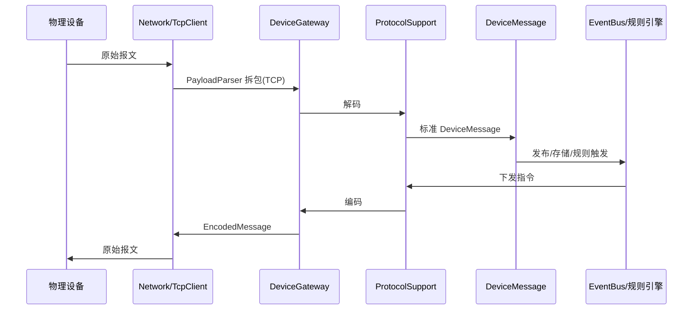

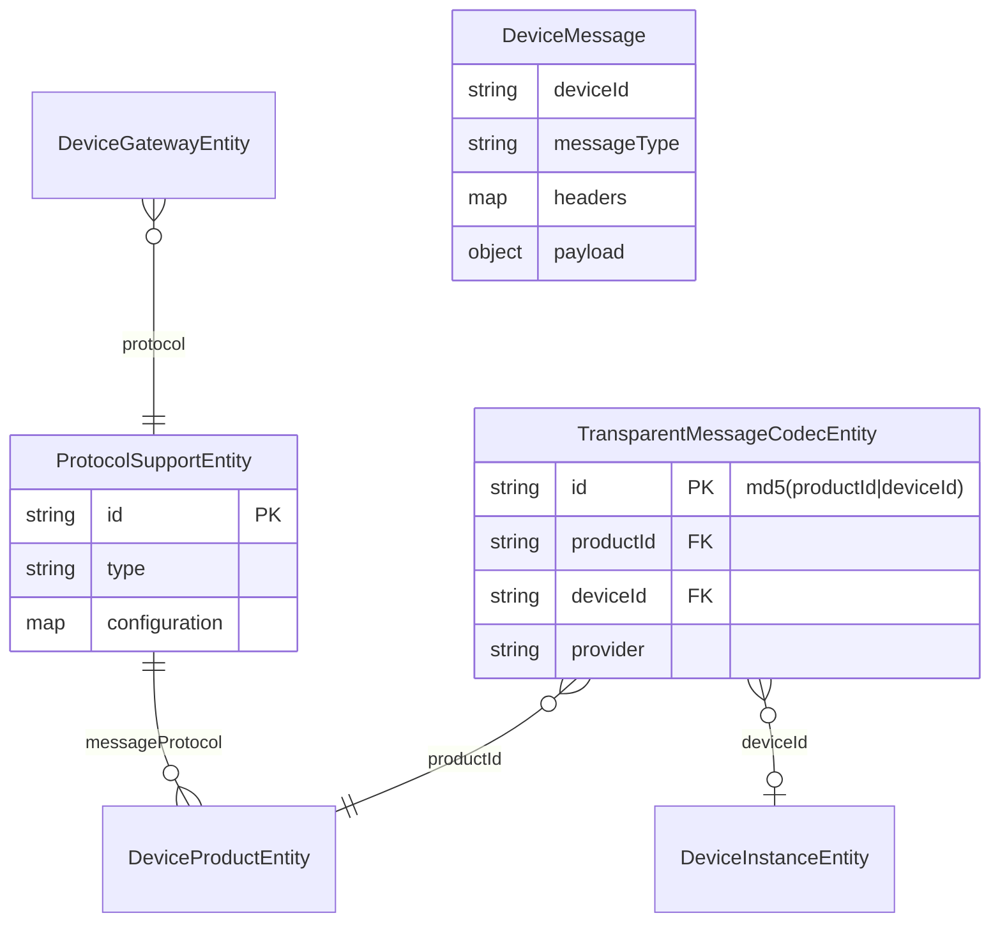

---

## 4. 规则引擎与场景联动 (Rule Engine & Scene)

用于实现设备的自动化控制和数据流转。

### 4.1 RuleEngine（规则引擎）

基于有向无环图（DAG）的任务流引擎。

| 层级 | 类/接口 | 路径 |
|------|---------|------|
| 接口 | `RuleEngine` | 外部依赖 `org.jetlinks.rule.engine.api.RuleEngine` |
| 实现 | `ClusterRuleEngine` | 外部依赖 `rule-engine-cluster` |
| 配置 | `RuleEngineConfiguration` | `jetlinks-components/rule-engine-component/.../configuration/RuleEngineConfiguration.java` |
| 规则实例实体 | `RuleInstanceEntity` | `jetlinks-manager/rule-engine-manager/.../entity/RuleInstanceEntity.java` |
| 数据库表 | `rule_instance` | — |

**关键字段（`RuleInstanceEntity`）**：

| 字段 | 说明 |
|------|------|
| `modelId` / `name` | 模型 ID / 名称 |
| `modelType` / `modelMeta` / `modelVersion` | 模型元数据 |
| `state` | 规则实例状态 |

### 4.2 TaskExecutorProvider（任务执行器）

规则引擎中不同节点的执行器提供者。

| 实现类 | executor 标识 | 说明 |
|--------|--------------|------|
| `SceneTaskExecutorProvider` | `"scene"` | 场景执行 |
| `ReactorQLTaskExecutorProvider` | `"reactor-ql"` | ReactorQL 查询 |
| `DeviceMessageSendTaskExecutorProvider` | 设备消息下发 | 控制设备 |
| `DeviceDataTaskExecutorProvider` | 设备数据 | 数据处理 |
| `TimerTaskExecutorProvider` | 定时 | 定时任务 |
| `DelayTaskExecutorProvider` | 延迟 | 延时执行 |
| `AlarmTaskExecutorProvider` | 告警 | 告警触发 |
| `NotifierTaskExecutorProvider` | 通知 | 发送通知 |
| `ScriptTaskExecutorProvider` | 脚本 | 脚本执行 |
| `SqlExecutorTaskExecutorProvider` | SQL | SQL 处理 |

### 4.3 Scene（场景联动）

典型的 IF-THEN 业务逻辑封装。

| 层级 | 类/接口 | 路径 |
|------|---------|------|
| 持久化 | `SceneEntity` | `jetlinks-manager/rule-engine-manager/.../entity/SceneEntity.java` |
| 运行时模型 | `SceneRule` | `.../rule-engine-manager/.../scene/SceneRule.java` |
| API 响应 | `SceneRuleInfo` | `.../web/response/SceneRuleInfo.java` |
| 数据库表 | `rule_scene` | — |

**关键字段（`SceneEntity` / `SceneRule`）**：

| 字段 | 说明 |
|------|------|
| `id` / `name` | 场景 ID / 名称 |
| `triggerType` / `trigger` | 触发器类型 / 触发器配置 |
| `terms` | 触发条件（`List<Term>`） |
| `actions` / `branches` | 执行动作 / 分支条件动作 |
| `parallel` | 是否并行执行 |
| `state` / `options` / `features` | 状态 / 选项 / 特性 |

### 4.4 Trigger（触发器）

| 类 | 路径 | 关键字段 |
|----|------|----------|
| `Trigger`（聚合） | `.../scene/Trigger.java` | `type`, `device`, `timer`, `configuration`, `shakeLimit` |
| `DeviceTrigger` | `.../internal/triggers/DeviceTrigger.java` | `productId`, `operation`（`DeviceOperation`） |
| `TimerTrigger` | `.../internal/triggers/TimerTrigger.java` | 继承 `TimerSpec`（cron/周期/一次等） |
| `ManualTrigger` | `.../internal/triggers/ManualTrigger.java` | 空配置，手动触发 |

Provider 体系：`SceneTriggerProvider<E>` + `DeviceTriggerProvider` / `TimerTriggerProvider` / `ManualTriggerProvider`

### 4.5 Action（执行动作）

| 类 | 路径 | 关键字段 |
|----|------|----------|
| `SceneAction`（聚合） | `.../scene/SceneAction.java` | `executor`, `notify`, `device`, `delay`, `alarm`, `terms`, `configuration` |
| `DeviceAction` | `.../internal/actions/DeviceAction.java` | `productId`, `message`（设备指令 Map） |
| `NotifyAction` | `.../internal/actions/NotifyAction.java` | `notifyType`, `notifierId`, `templateId`, `variables` |

Provider 体系：`SceneActionProvider<C>` + `DeviceActionProvider` / `NotifyActionProvider` / `AlarmActionProvider` / `DelayActionProvider`

### 4.6 AlarmTarget & AlarmRule（告警管理）

| 概念 | 类 | 路径 |
|------|-----|------|
| 告警目标 | `AlarmTarget`（接口） | `.../rule-engine-manager/.../alarm/AlarmTarget.java` |
| | `DeviceAlarmTarget`, `ProductAlarmTarget`, `SceneAlarmTarget` | 同目录 |
| 告警目标信息 | `AlarmTargetInfo` | `.../alarm/AlarmTargetInfo.java` |
| 告警规则处理 | `AlarmRuleHandler` | `.../alarm/AlarmRuleHandler.java` |
| 告警配置 | `AlarmConfigEntity` | `.../entity/AlarmConfigEntity.java`（表 `alarm_config`） |
| 规则绑定 | `AlarmRuleBindEntity` | `.../entity/AlarmRuleBindEntity.java`（表 `s_alarm_rule_bind`） |
| 告警记录 | `AlarmRecordEntity` | `.../entity/AlarmRecordEntity.java`（表 `alarm_record`） |

**AlarmRecordEntity 关键字段**：`alarmConfigId`, `targetType/Id/Key/Name`, `sourceType/Id/Name`, `termSpec`, `alarmTime`, `level`, `state`

> **命名说明**：本仓库无独立 `AlarmRule` 类；告警规则逻辑在 `AlarmRuleHandler`，配置在 `AlarmConfigEntity`，与场景的绑定在 `AlarmRuleBindEntity`。

### 4.7 ReactorQL

JetLinks 自研的基于响应式流的类 SQL 处理引擎。

| 层级 | 类 | 路径/来源 |
|------|-----|----------|
| 核心 | `ReactorQL` | 外部依赖 `reactor-ql` |
| 上下文 | `ReactorQLContext` | 外部依赖 |
| 规则节点 | `ReactorQLTaskExecutorProvider` | `jetlinks-components/rule-engine-component/.../executor/` |
| 场景用法 | `SceneRule`, `SceneTaskExecutorProvider` | `jetlinks-manager/rule-engine-manager/.../scene/` |
| 扩展函数 | `ComplexExistsFunction` 等 | `jetlinks-components/common-component/.../reactorql/` |

**使用场景**：
- 场景触发：`SceneTriggerProvider.createSql()` → ReactorQL 订阅 EventBus 设备主题
- 规则引擎：`ReactorQLTaskExecutorProvider` 作为独立节点执行 SQL
- 与 `Term` / `TermSpec` 条件表达式配合

### 4.8 规则引擎与场景关系图

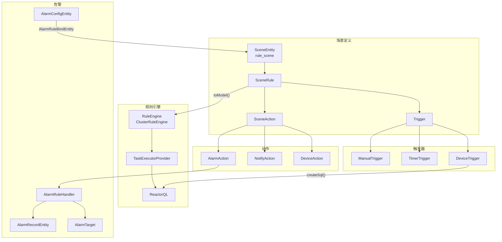

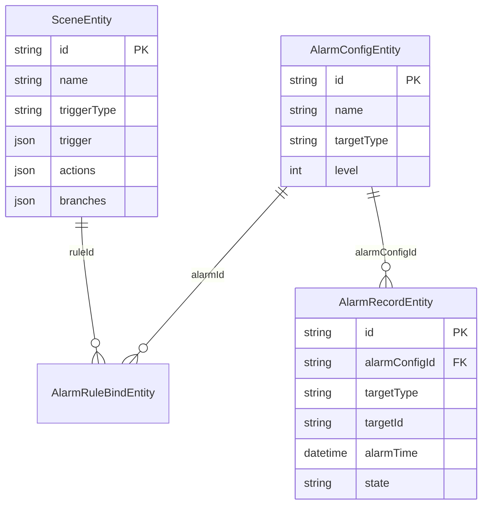

---

## 5. 数据存储与时序数据库 (Data Storage & TimeSeries)

管理海量的物联网设备运行数据。

### 5.1 TimeSeriesManager（时序数据管理）

高度抽象的时序数据存储接口。

| 层级 | 类 | 路径 |
|------|-----|------|
| 接口 | `TimeSeriesManager` | `jetlinks-components/timeseries-component/.../TimeSeriesManager.java` |
| 服务接口 | `TimeSeriesService` | 同上目录 |
| 数据 | `TimeSeriesData`, `TimeSeriesMetric`, `TimeSeriesMetadata` | 同上目录 |

**TimeSeriesManager 方法**：`getService(metric)`, `registerMetadata(metadata)`

**TimeSeriesData**：`timestamp` + `Map<String, Object> data`

**TimeSeriesMetadata**：`metric` + `List<PropertyMetadata> properties`

### 5.2 多存储策略支持

| 后端 | Manager | 组件路径 | 特性 |
|------|---------|----------|------|
| **Elasticsearch** | `ElasticSearchTimeSeriesManager` | `jetlinks-components/elasticsearch-component/` | 按列/按行存储、自动分表（TimeByDay/Week/Month） |
| **TimescaleDB** | `TimescaleDBTimeSeriesManager` | `jetlinks-components/timescaledb-component/` | 基于 PostgreSQL 的 Hypertable |
| **TDengine** | Things 数据写入 | `jetlinks-components/tdengine-component/` | 涛思数据，`SchemalessTDEngineDataWriter` |

**Elasticsearch 相关**：
- `ElasticSearchService`, `ElasticSearchIndexManager`, `DefaultElasticSearchIndexMetadata`
- Things 查询：`ElasticSearchRowModeQueryOperations`, `ElasticSearchColumnModeSaveOperations`

**TimescaleDB 相关**：
- `TimescaleDBOperations`, `CreateHypertable`, `CreateRetentionPolicy`
- Things 查询：`TimescaleDBColumnModeQueryOperations`, `TimescaleDBRowModeQueryOperations`

**TDengine 相关**：
- `TDengineSchema`, `Point`（metric, table, values, tags, timestamp）
- Things：`TDengineRowModeStrategy`, `TDengineColumnModeQueryOperations`

**设备产品存储策略**：`DeviceProductEntity.storePolicy` / `storePolicyConfiguration` 决定设备数据写入哪个后端。

### 5.3 数据存储关系图

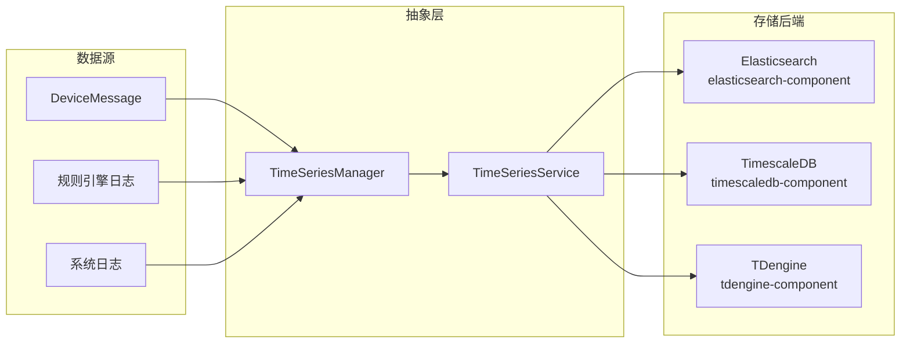

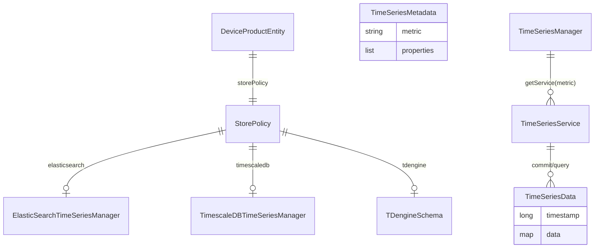

---

## 6. 消息通知通道 (Notification & Messaging)

提供平台向外部发送消息的能力。

### 6.1 Notifier（通知器）

统一的通知门面。

| 层级 | 类 | 路径 |
|------|-----|------|
| 接口 | `Notifier<T extends Template>` | `jetlinks-components/notify-core/.../Notifier.java` |
| 管理器 | `NotifierManager` | 同上目录 |
| Provider | `NotifierProvider` | 同上目录 |
| 配置实体 | `NotifyConfigEntity` | `jetlinks-manager/notify-manager/.../entity/NotifyConfigEntity.java` |
| 数据库表 | `notify_config` | — |

**关键字段（`NotifyConfigEntity`）**：`name`, `type`, `provider`, `configuration` → `NotifierProperties`

### 6.2 Channel（通知渠道）

源码集成了丰富的通知组件。

| 渠道 | 组件 |
|------|------|
| 钉钉 | `dingtalk` |
| 微信 | `wechat` |
| 阿里云短信 | `sms` |
| 语音 | `voice` |
| 邮件 | `email` |
| Webhook | `webhook` |

| 层级 | 类 | 路径 |
|------|-----|------|
| Channel 接口 | `NotifyChannel` | `jetlinks-manager/notify-manager/.../subscriber/channel/NotifyChannel.java` |
| Channel 配置实体 | `NotifySubscriberChannelEntity` | `.../entity/NotifySubscriberChannelEntity.java` |
| Channel Provider | `NotifyChannelProvider` | 同上目录 |
| 数据库表 | `notify_subscriber_channel` | — |

> **注意**：`NotifyChannel` 是订阅推送通道（如站内信），与 `Notifier` 的发送通道是并行体系。

### 6.3 Template（通知模板）

| 层级 | 类 | 路径 |
|------|-----|------|
| 接口 | `Template` | `jetlinks-components/notify-core/.../template/Template.java` |
| 实体 | `NotifyTemplateEntity` | `jetlinks-manager/notify-manager/.../entity/NotifyTemplateEntity.java` |
| 数据库表 | `notify_template` | — |

**关键字段（`NotifyTemplateEntity`）**：`type`, `provider`, `name`, `template`（Map）, `variableDefinitions`, `configId`

### 6.4 通知关系图

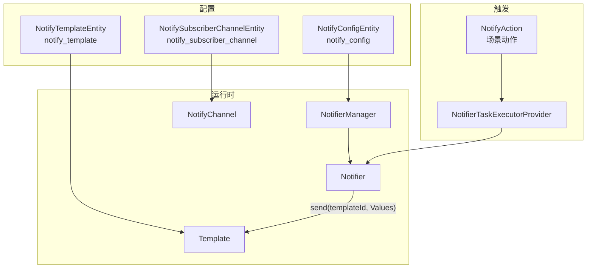

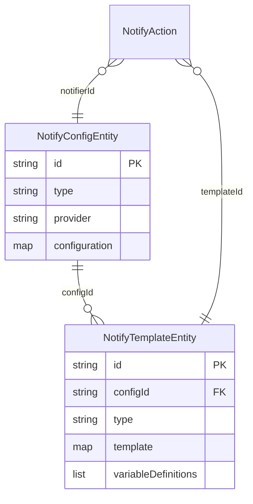

---

## 7. 系统基础支撑组件 (Foundation & System Managers)

### 7.1 Authentication（认证与权限）

基于多维度（Dimension）的用户、权限、菜单管控。

| 概念 | 类 | 路径 |
|------|-----|------|
| Dimension | `Dimension` | 外部依赖 `org.hswebframework.web.authorization.Dimension` |
| Dimension Provider | `BaseDimensionProvider<T>` | `jetlinks-manager/authentication-manager/.../dimension/BaseDimensionProvider.java` |
| Organization | `OrganizationEntity` | `.../auth/entity/OrganizationEntity.java`（表 `s_organization`） |
| Role | `RoleEntity` | `.../auth/entity/RoleEntity.java`（表 `s_role`） |
| Org Provider | `OrganizationDimensionProvider` | `.../dimension/OrganizationDimensionProvider.java` |
| Role Provider | `RoleDimensionProvider` | 同上目录 |

**OrganizationEntity 关键字段**：`id`, `code`, `name`, `type`, `parentId`, `path` → `toDimension()` → `OrgDimensionType.org`

**RoleEntity 关键字段**：`name`, `description`, `state`, `groupId` → `toDimension()` → `DefaultDimensionType.role`

### 7.2 Plugin（插件驱动）

| 类 | 路径 |
|-----|------|
| `PluginDriverEntity` | `jetlinks-components/plugin-component/.../impl/PluginDriverEntity.java`（表 `s_plugin_driver`） |
| `PluginDriverConfig` | `.../plugin-component/.../PluginDriverConfig.java` |
| `PluginDriverManager` | 同 plugin-component |
| `PluginDeviceGateway` | `.../plugin/device/PluginDeviceGateway.java` |

**PluginDriverEntity 关键字段**：`name`, `type`（`PluginType`）, `provider`, `configuration`, `version`, `filename`

### 7.3 Dashboard（监控大盘）

| 类 | 路径 |
|-----|------|
| `DashboardDefinition` | `jetlinks-components/dashboard-component/.../DashboardDefinition.java` |
| `DefaultDashboardDefinition` | enum: `systemMonitor`, `jvmMonitor`, `device` |
| `DashboardObject` | 同目录 |
| `Measurement` | 同目录 |
| `MeasurementDimension` | 同目录 |
| `MeasurementProvider` | `.../supports/MeasurementProvider.java` |

**层次关系**：

```
DashboardDefinition（仪表板）
  → DashboardObject（对象，如设备/网关）
    → Measurement（指标，如属性/消息/状态）
      → MeasurementDimension（维度：实时/历史/聚合）
```

### 7.4 Relation（关系组件）

| 类 | 路径 |
|-----|------|
| `RelationEntity`（关系定义） | `jetlinks-components/relation-component/.../entity/RelationEntity.java`（表 `s_object_relation`） |
| `RelatedEntity`（关系实例） | `.../entity/RelatedEntity.java`（表 `s_object_related`） |
| 运行时 | `RelationObject` | 外部依赖 `org.jetlinks.core.things.relation.RelationObject` |

**RelationEntity 关键字段**：`objectType`, `relation`, `targetType`, `name`, `reverseName`

**RelatedEntity 关键字段**：`objectType/Id/Key/Name`, `relatedType/Id/Key/Name`, `relation`

### 7.5 基础支撑关系图

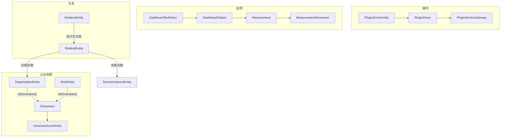

---

## 8. 跨模块全局关系总览

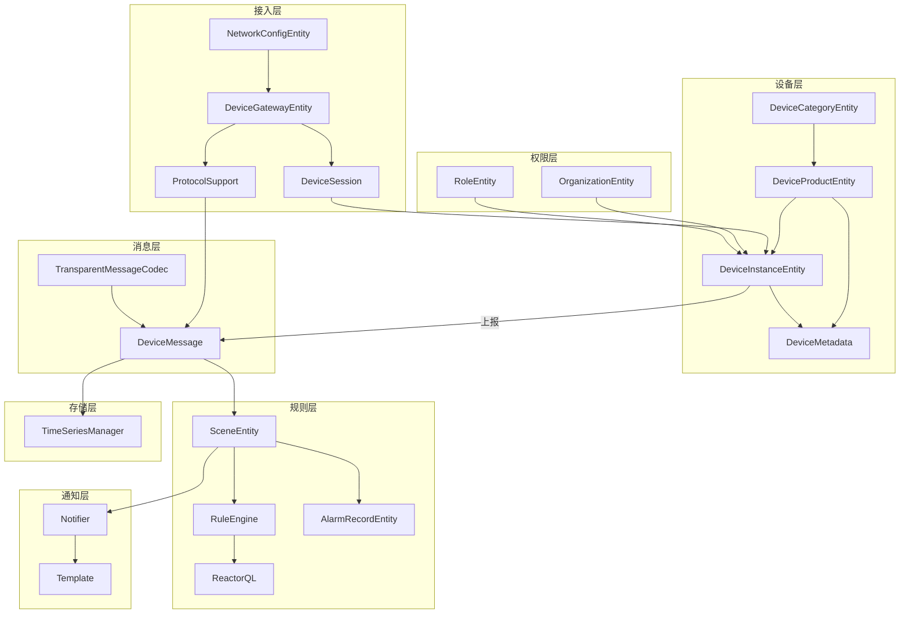

---

## 9. 命名对照表

| 用户术语 | 本仓库实际对应 |
|----------|----------------|
| DeviceProduct | `DeviceProductEntity`（DB）+ `ProductInfo` / `DeviceProductOperator`（运行时） |
| DeviceInstance | `DeviceInstanceEntity`（DB）+ `DeviceInfo` / `DeviceOperator`（运行时） |
| ThingMetadata | `ThingMetadata` / `DeviceMetadata`（外部 jetlinks-core）；Community 中以 JSON 字符串存储 |
| Property / Event / Function | `PropertyMetadata` / `EventMetadata` / `FunctionMetadata` |
| Network | `NetworkConfigEntity`（DB）+ `Network` 接口（运行时） |
| DeviceGateway | `DeviceGatewayEntity`（DB）+ `DeviceGateway` 接口（运行时） |
| DeviceSession | `DeviceSession` 接口（外部 jetlinks-core）+ 各协议实现类 |
| ProtocolSupport | `ProtocolSupportEntity`（DB）+ `ProtocolSupport` 接口（外部 jetlinks-core） |
| Scene | `SceneEntity`（DB）+ `SceneRule`（运行时） |
| AlarmRule | 无独立类；`AlarmRuleHandler` + `AlarmConfigEntity` + `AlarmRuleBindEntity` |
| Channel | `NotifyChannel` / `NotifySubscriberChannelEntity`（订阅通道） |
| ReactorQL | 外部 `reactor-ql` 库；本仓库通过场景触发与规则节点集成 |
| TimeSeriesManager | `TimeSeriesManager` 接口 + ES/TimescaleDB/TDengine 实现 |

---

## 10. 模块路径速查

| 模块 | 根路径 |
|------|--------|
| device-manager | `jetlinks-manager/device-manager/` |
| network-manager | `jetlinks-manager/network-manager/` |
| rule-engine-manager | `jetlinks-manager/rule-engine-manager/` |
| notify-manager | `jetlinks-manager/notify-manager/` |
| authentication-manager | `jetlinks-manager/authentication-manager/` |
| network-core | `jetlinks-components/network-component/network-core/` |
| tcp/mqtt/http-component | `jetlinks-components/network-component/{tcp,mqtt,http}-component/` |
| gateway-component | `jetlinks-components/gateway-component/` |
| protocol-component | `jetlinks-components/protocol-component/` |
| rule-engine-component | `jetlinks-components/rule-engine-component/` |
| timeseries-component | `jetlinks-components/timeseries-component/` |
| elasticsearch-component | `jetlinks-components/elasticsearch-component/` |
| timescaledb-component | `jetlinks-components/timescaledb-component/` |
| tdengine-component | `jetlinks-components/tdengine-component/` |
| notify-core | `jetlinks-components/notify-core/` |
| plugin-component | `jetlinks-components/plugin-component/` |
| dashboard-component | `jetlinks-components/dashboard-component/` |
| relation-component | `jetlinks-components/relation-component/` |
